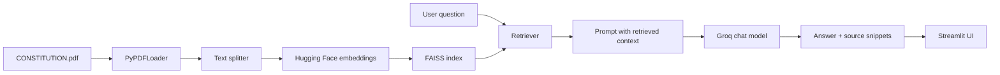

# Indian Constitution RAG Model


This repository contains a retrieval-augmented generation chatbot for asking questions against a local PDF copy of the Constitution of India. It uses LangChain, Hugging Face sentence embeddings, FAISS vector search, Groq-hosted chat models, and Streamlit.

## Value Proposition

The project demonstrates the core pieces of a RAG workflow:

- load and chunk a PDF
- build a local vector index
- retrieve relevant context
- generate a grounded answer
- show retrieved snippets for transparency
- optionally convert answers to audio

## Architecture



## Project Structure

```text
RAG_MODEL/
|-- main.py
|-- build_index.py
|-- requirements.txt
|-- README.md
|-- .gitignore
|-- data/
|   `-- CONSTITUTION.pdf
|-- notebooks/
|   `-- RAG_CONSTITUTION.ipynb
|-- src/
|   `-- constitution_rag/
|       |-- app.py
|       |-- audio.py
|       |-- indexing.py
|       |-- rag_chain.py
|       `-- settings.py
`-- tests/
    `-- test_settings.py
```

## Quick Start

```bash
python -m venv .venv
.venv\\Scripts\\activate
pip install -r requirements.txt
python build_index.py
```

Create `.streamlit/secrets.toml`:

```toml
GROQ_API_KEY = "your_groq_api_key"
FAISS_INDEX_TRUSTED = "true"
ENABLE_AUDIO = "true"
```

Run the app:

```bash
streamlit run main.py
```

On macOS/Linux:

```bash
source .venv/bin/activate
```

## Configuration

| Setting | Required | Purpose |
|---|---|---|
| `GROQ_API_KEY` | Yes | API key for Groq chat completion |
| `FAISS_INDEX_TRUSTED` | Yes | Allows loading the local FAISS pickle index only after you confirm it was generated from trusted files |
| `RAG_GROQ_MODEL` | No | Overrides the default Groq model |
| `ENABLE_AUDIO` | No | Enables or disables gTTS audio output |

## Security Notes

- FAISS local indexes use pickle internally. This app blocks loading until `FAISS_INDEX_TRUSTED=true` is set.
- Only set `FAISS_INDEX_TRUSTED=true` for an index you generated yourself with `build_index.py`.
- Do not commit `.env`, `.streamlit/secrets.toml`, or API keys.
- The app is not legal advice. It answers from retrieved PDF context and may be incomplete.

## Improvements Included

- Added reproducible `build_index.py`.
- Added guarded FAISS index loading instead of unconditional dangerous deserialization.
- Added source snippet display.
- Added environment/secrets-based configuration.
- Added cached embedding, LLM, and vector-store loading.
- Added clearer error handling for missing keys and missing indexes.

## Development Workflow

```bash
set PYTHONPATH=src
python -m compileall main.py build_index.py src
pytest -q
python build_index.py
streamlit run main.py
```

On macOS/Linux, use `export PYTHONPATH=src`.

## Roadmap

- Add citation formatting by page number
- Add retrieval evaluation set
- Add answer quality regression tests
- Add document upload support
- Replace single-document index with a managed document ingestion pipeline

## FAQ

**Does this provide legal advice?**
No. It is an educational RAG demo.

**Why is `FAISS_INDEX_TRUSTED` required?**
LangChain FAISS indexes use pickle during local loading. Pickle can execute unsafe payloads, so this project requires explicit trust.

**Why do answers mention limited context?**
The chatbot is instructed not to invent answers beyond retrieved source text.

## Troubleshooting

| Issue | Fix |
|---|---|
| FAISS index not found | Run `python build_index.py`. |
| API key error | Add `GROQ_API_KEY` to `.streamlit/secrets.toml` or environment variables. |
| FAISS trust error | Set `FAISS_INDEX_TRUSTED=true` after building the index locally. |
| Audio fails | Set `ENABLE_AUDIO=false` or check network access for gTTS. |

## License

No license file is currently included. Add a license before reusing or distributing this project.
